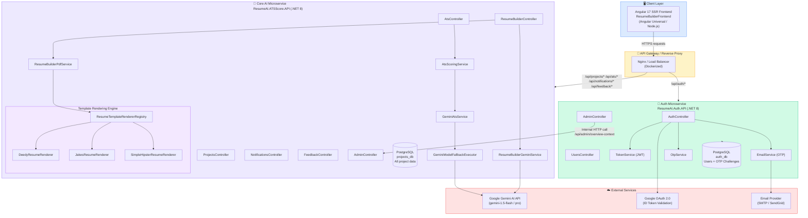

## 1. System Architecture Diagram

```mermaid
graph TB
    subgraph Client["🖥️ Client Layer"]
        FE["Angular 17 SSR Frontend<br/>ResumeBuilderFrontend<br/>(Angular Universal / Node.js)"]
    end

    subgraph Gateway["🔀 API Gateway / Reverse Proxy"]
        NG["Nginx / Load Balancer<br/>(Dockerized)"]
    end

    subgraph AuthService["🔐 Auth Microservice<br/>ResumeAI.Auth.API (.NET 8)"]
        AC["AuthController"]
        UC["UsersController"]
        AuthAdminC["AdminController"]
        TS["TokenService (JWT)"]
        ES["EmailService (OTP)"]
        OS["OtpService"]
        AuthDB[("PostgreSQL<br/>auth_db<br/>Users + OTP Challenges")]
    end

    subgraph ATSService["🤖 Core AI Microservice<br/>ResumeAI.ATSScore.API (.NET 8)"]
        AtsC["AtsController"]
        ProjC["ProjectsController"]
        RBC["ResumeBuilderController"]
        NotifC["NotificationsController"]
        FeedC["FeedbackController"]
        AtsAdminC["AdminController"]
        
        AtsScoreSvc["AtsScoringService"]
        GeminiAtsSvc["GeminiAtsService"]
        GeminiFallback["GeminiModelFallbackExecutor"]
        RBGeminiSvc["ResumeBuilderGeminiService"]
        RBPdfSvc["ResumeBuilderPdfService"]
        
        subgraph TemplateRenderers["Template Rendering Engine"]
            TRR["ResumeTemplateRendererRegistry"]
            DeedyR["DeedyResumeRenderer"]
            JakesR["JakesResumeRenderer"]
            HipsterR["SimpleHipsterResumeRenderer"]
        end
        
        AtsDB[("PostgreSQL<br/>projects_db<br/>All project data")]
    end

    subgraph External["☁️ External Services"]
        GeminiAPI["Google Gemini AI API<br/>(gemini-1.5-flash / pro)"]
        GoogleOAuth["Google OAuth 2.0<br/>(ID Token Validation)"]
        EmailProvider["Email Provider<br/>(SMTP / SendGrid)"]
    end

    FE -->|"HTTPS requests"| NG
    NG -->|"/api/auth/*"| AuthService
    NG -->|"/api/projects/* /api/ats/* /api/notifications/* /api/feedback/*"| ATSService
    AuthAdminC -->|"Internal HTTP call<br/>/api/admin/overview-context"| AtsAdminC

    AC --> TS
    AC --> ES
    AC --> OS
    AC --> GoogleOAuth
    AuthService --> AuthDB

    AtsC --> AtsScoreSvc
    AtsScoreSvc --> GeminiAtsSvc
    GeminiAtsSvc --> GeminiFallback
    RBC --> RBGeminiSvc
    RBC --> RBPdfSvc
    RBPdfSvc --> TRR
    TRR --> DeedyR
    TRR --> JakesR
    TRR --> HipsterR
    GeminiFallback --> GeminiAPI
    RBGeminiSvc --> GeminiAPI
    ES --> EmailProvider

    ATSService --> AtsDB

    style Client fill:#dbeafe,stroke:#3b82f6
    style Gateway fill:#fef3c7,stroke:#f59e0b
    style AuthService fill:#d1fae5,stroke:#10b981
    style ATSService fill:#ede9fe,stroke:#8b5cf6
    style External fill:#fee2e2,stroke:#ef4444
    style TemplateRenderers fill:#f3e8ff,stroke:#a855f7
```

---

