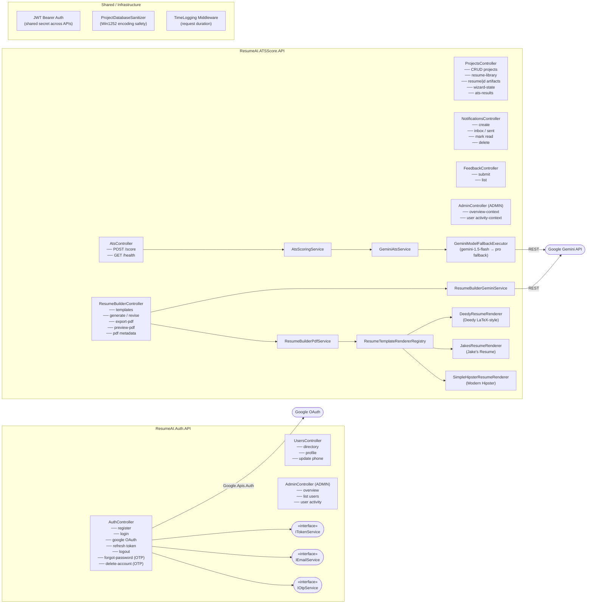

## 2. Services / Microservices Diagram

```mermaid
graph LR
    subgraph "ResumeAI.Auth.API"
        direction TB
        AuthCtrl["AuthController<br/>── register<br/>── login<br/>── google OAuth<br/>── refresh token<br/>── logout<br/>── forgot-password (OTP)<br/>── delete-account (OTP)"]
        UsersCtrl["UsersController<br/>── directory<br/>── profile<br/>── update phone"]
        AuthAdminCtrl["AdminController (ADMIN)<br/>── overview<br/>── list users<br/>── user activity"]
        
        ITokenSvc(["«interface»<br/>ITokenService"])
        IEmailSvc(["«interface»<br/>IEmailService"])
        IOtpSvc(["«interface»<br/>IOtpService"])
        
        AuthCtrl --> ITokenSvc
        AuthCtrl --> IEmailSvc
        AuthCtrl --> IOtpSvc
    end

    subgraph "ResumeAI.ATSScore.API"
        direction TB
        AtsCtrl["AtsController<br/>── POST /score<br/>── GET /health"]
        ProjCtrl["ProjectsController<br/>── CRUD projects<br/>── resume-library<br/>── resume/jd artifacts<br/>── wizard-state<br/>── ats-results"]
        RBCtrl["ResumeBuilderController<br/>── templates<br/>── generate / revise<br/>── export-pdf<br/>── preview-pdf<br/>── pdf metadata"]
        NotifCtrl["NotificationsController<br/>── create<br/>── inbox / sent<br/>── mark read<br/>── delete"]
        FeedCtrl["FeedbackController<br/>── submit<br/>── list"]
        AtsAdminCtrl["AdminController (ADMIN)<br/>── overview-context<br/>── user activity-context"]

        AtsSvc["AtsScoringService"]
        GeminiAtsSvc2["GeminiAtsService"]
        FallbackExec["GeminiModelFallbackExecutor<br/>(gemini-1.5-flash → pro fallback)"]
        RBGemini["ResumeBuilderGeminiService"]
        RBPdf["ResumeBuilderPdfService"]
        
        TRReg["ResumeTemplateRendererRegistry"]
        DeedyRend["DeedyResumeRenderer<br/>(Deedy LaTeX-style)"]
        JakesRend["JakesResumeRenderer<br/>(Jake's Resume)"]
        HipRend["SimpleHipsterResumeRenderer<br/>(Modern Hipster)"]

        AtsCtrl --> AtsSvc
        AtsSvc --> GeminiAtsSvc2
        GeminiAtsSvc2 --> FallbackExec
        RBCtrl --> RBGemini
        RBCtrl --> RBPdf
        RBPdf --> TRReg
        TRReg --> DeedyRend
        TRReg --> JakesRend
        TRReg --> HipRend
    end

    subgraph "Shared / Infrastructure"
        JWT["JWT Bearer Auth<br/>(shared secret across APIs)"]
        DBSanitizer["ProjectDatabaseSanitizer<br/>(Win1252 encoding safety)"]
        TimeMiddleware["TimeLogging Middleware<br/>(request duration)"]
    end

    FallbackExec -->|"REST"| GeminiCloud(["Google Gemini API"])
    RBGemini -->|"REST"| GeminiCloud
    AuthCtrl -->|"Google.Apis.Auth"| GoogleOAuthCloud(["Google OAuth"])
```

---

