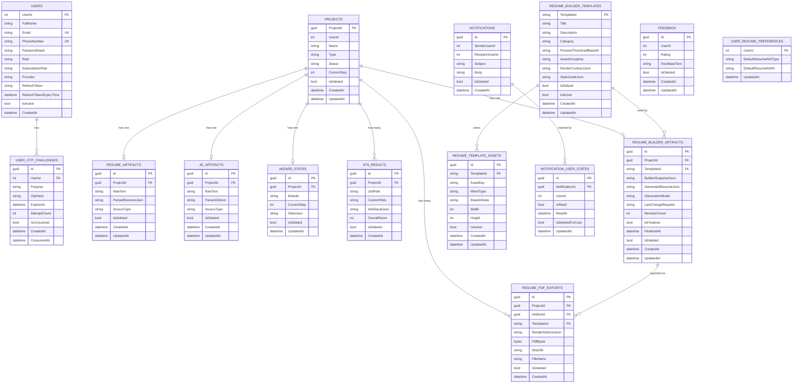

## 3. Entity-Relationship Diagram (ERD)

```mermaid
erDiagram
    %% ── Auth Database ──────────────────────────────────────────
    USERS {
        int UserId PK
        string FullName
        string Email UK
        string PhoneNumber UK
        string PasswordHash
        string Role
        string SubscriptionPlan
        string Provider
        string RefreshToken
        datetime RefreshTokenExpiryTime
        bool IsActive
        datetime CreatedAt
    }

    USER_OTP_CHALLENGES {
        guid Id PK
        int UserId FK
        string Purpose
        string OtpHash
        datetime ExpiresAt
        int AttemptCount
        bool IsConsumed
        datetime CreatedAt
        datetime ConsumedAt
    }

    %% ── Projects Database ──────────────────────────────────────
    PROJECTS {
        guid ProjectId PK
        int UserId
        string Name
        string Type
        string Status
        int CurrentStep
        bool IsDeleted
        datetime CreatedAt
        datetime UpdatedAt
    }

    RESUME_ARTIFACTS {
        guid Id PK
        guid ProjectId FK
        string RawText
        string ParsedResumeJson
        string SourceType
        bool IsDeleted
        datetime CreatedAt
        datetime UpdatedAt
    }

    JD_ARTIFACTS {
        guid Id PK
        guid ProjectId FK
        string RawText
        string ParsedJdJson
        string SourceType
        bool IsDeleted
        datetime CreatedAt
        datetime UpdatedAt
    }

    WIZARD_STATES {
        guid Id PK
        guid ProjectId FK
        string Module
        int CurrentStep
        string StateJson
        bool IsDeleted
        datetime UpdatedAt
    }

    ATS_RESULTS {
        guid Id PK
        guid ProjectId FK
        string JobRole
        string CustomRole
        string AtsResultJson
        int OverallScore
        bool IsDeleted
        datetime CreatedAt
    }

    RESUME_BUILDER_ARTIFACTS {
        guid Id PK
        guid ProjectId FK
        string TemplateId FK
        string BuilderSnapshotJson
        string GeneratedResumeJson
        string GenerationModel
        string LastChangeRequest
        int RevisionCount
        bool IsFinalized
        datetime FinalizedAt
        bool IsDeleted
        datetime CreatedAt
        datetime UpdatedAt
    }

    RESUME_BUILDER_TEMPLATES {
        string TemplateId PK
        string Title
        string Description
        string Category
        string PreviewThumbnailBase64
        string AssetGroupKey
        string RenderContractJson
        string StyleGuideJson
        bool IsDefault
        bool IsActive
        datetime CreatedAt
        datetime UpdatedAt
    }

    RESUME_TEMPLATE_ASSETS {
        guid Id PK
        string TemplateId FK
        string AssetKey
        string MimeType
        string Base64Data
        int Width
        int Height
        bool IsActive
        datetime CreatedAt
        datetime UpdatedAt
    }

    RESUME_PDF_EXPORTS {
        guid Id PK
        guid ProjectId FK
        guid ArtifactId FK
        string TemplateId FK
        string RenderOptionsJson
        bytes PdfBytes
        string Sha256
        string FileName
        bool IsDeleted
        datetime CreatedAt
    }

    NOTIFICATIONS {
        guid Id PK
        int SenderUserId
        int RecipientUserId
        string Subject
        string Body
        bool IsDeleted
        datetime CreatedAt
    }

    NOTIFICATION_USER_STATES {
        guid Id PK
        guid NotificationId FK
        int UserId
        bool IsRead
        datetime ReadAt
        bool IsDeletedForUser
        datetime UpdatedAt
    }

    FEEDBACK {
        guid Id PK
        int UserId
        int Rating
        string FeedbackText
        bool IsDeleted
        datetime CreatedAt
        datetime UpdatedAt
    }

    USER_RESUME_PREFERENCES {
        int UserId PK
        string DefaultResumeRefType
        string DefaultResumeRefId
        datetime UpdatedAt
    }

    %% ── Relationships ──────────────────────────────────────────
    USERS ||--o{ USER_OTP_CHALLENGES : "has"
    PROJECTS ||--o| RESUME_ARTIFACTS : "has one"
    PROJECTS ||--o| JD_ARTIFACTS : "has one"
    PROJECTS ||--o| WIZARD_STATES : "has one"
    PROJECTS ||--o| RESUME_BUILDER_ARTIFACTS : "has one"
    PROJECTS ||--o{ ATS_RESULTS : "has many"
    PROJECTS ||--o{ RESUME_PDF_EXPORTS : "has many"
    RESUME_BUILDER_ARTIFACTS ||--o{ RESUME_PDF_EXPORTS : "exported as"
    RESUME_BUILDER_TEMPLATES ||--o{ RESUME_BUILDER_ARTIFACTS : "used by"
    RESUME_BUILDER_TEMPLATES ||--o{ RESUME_TEMPLATE_ASSETS : "owns"
    NOTIFICATIONS ||--o{ NOTIFICATION_USER_STATES : "tracked by"
```

---

