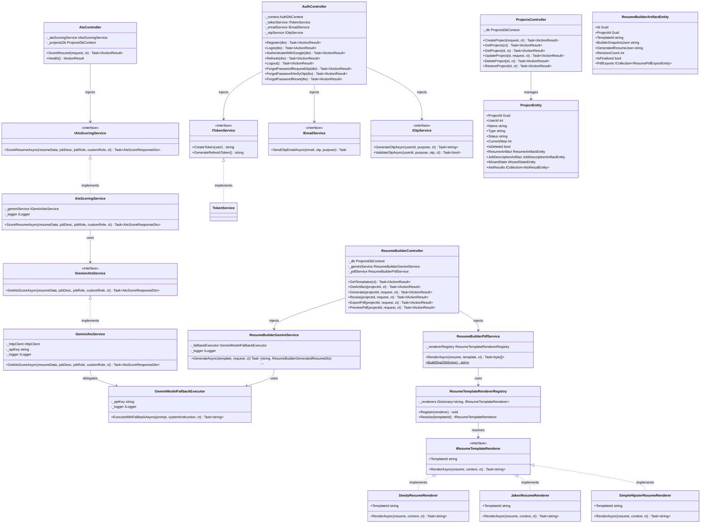

## 4. UML Class Diagram

```mermaid
classDiagram
    %% ── Interfaces ────────────────────────────────────────────
    class IAtsScoringService {
        <<interface>>
        +ScoreResumeAsync(resumeData, jobDesc, jobRole, customRole, ct) Task~AtsScoreResponseDto~
    }

    class IGeminiAtsService {
        <<interface>>
        +GetAtsScoreAsync(resumeData, jobDesc, jobRole, customRole, ct) Task~AtsScoreResponseDto~
    }

    class IResumeTemplateRenderer {
        <<interface>>
        +TemplateId string
        +RenderAsync(resume, context, ct) Task~string~
    }

    class ITokenService {
        <<interface>>
        +CreateToken(user) string
        +GenerateRefreshToken() string
    }

    class IEmailService {
        <<interface>>
        +SendOtpEmailAsync(email, otp, purpose) Task
    }

    class IOtpService {
        <<interface>>
        +GenerateOtpAsync(userId, purpose, ct) Task~string~
        +ValidateOtpAsync(userId, purpose, otp, ct) Task~bool~
    }

    %% ── Services ──────────────────────────────────────────────
    class AtsScoringService {
        -_geminiService IGeminiAtsService
        -_logger ILogger
        +ScoreResumeAsync(resumeData, jobDesc, jobRole, customRole, ct) Task~AtsScoreResponseDto~
    }

    class GeminiAtsService {
        -_httpClient HttpClient
        -_apiKey string
        -_logger ILogger
        +GetAtsScoreAsync(resumeData, jobDesc, jobRole, customRole, ct) Task~AtsScoreResponseDto~
    }

    class GeminiModelFallbackExecutor {
        -_apiKey string
        -_logger ILogger
        +ExecuteWithFallbackAsync(prompt, systemInstruction, ct) Task~string~
    }

    class ResumeBuilderGeminiService {
        -_fallbackExecutor GeminiModelFallbackExecutor
        -_logger ILogger
        +GenerateAsync(template, request, ct) Task~(string, ResumeBuilderGeneratedResumeDto)~
    }

    class ResumeBuilderPdfService {
        -_rendererRegistry ResumeTemplateRendererRegistry
        +RenderAsync(resume, template, ct) Task~byte[]~
        +BuildSha256(bytes) string$
    }

    class ResumeTemplateRendererRegistry {
        -_renderers Dictionary~string, IResumeTemplateRenderer~
        +Register(renderer) void
        +Resolve(templateId) IResumeTemplateRenderer
    }

    class DeedyResumeRenderer {
        +TemplateId string
        +RenderAsync(resume, context, ct) Task~string~
    }

    class JakesResumeRenderer {
        +TemplateId string
        +RenderAsync(resume, context, ct) Task~string~
    }

    class SimpleHipsterResumeRenderer {
        +TemplateId string
        +RenderAsync(resume, context, ct) Task~string~
    }

    %% ── Controllers ───────────────────────────────────────────
    class AtsController {
        -_atsScoringService IAtsScoringService
        -_projectsDb ProjectsDbContext
        +ScoreResume(request, ct) Task~IActionResult~
        +Health() IActionResult
    }

    class ProjectsController {
        -_db ProjectsDbContext
        +CreateProject(request, ct) Task~IActionResult~
        +GetProjects(ct) Task~IActionResult~
        +GetProject(id, ct) Task~IActionResult~
        +UpdateProject(id, request, ct) Task~IActionResult~
        +DeleteProject(id, ct) Task~IActionResult~
        +RestoreProject(id, ct) Task~IActionResult~
    }

    class ResumeBuilderController {
        -_db ProjectsDbContext
        -_geminiService ResumeBuilderGeminiService
        -_pdfService ResumeBuilderPdfService
        +GetTemplates(ct) Task~IActionResult~
        +GetArtifact(projectId, ct) Task~IActionResult~
        +Generate(projectId, request, ct) Task~IActionResult~
        +Revise(projectId, request, ct) Task~IActionResult~
        +ExportPdf(projectId, request, ct) Task~IActionResult~
        +PreviewPdf(projectId, request, ct) Task~IActionResult~
    }

    class AuthController {
        -_context AuthDbContext
        -_tokenService ITokenService
        -_emailService IEmailService
        -_otpService IOtpService
        +Register(dto) Task~IActionResult~
        +Login(dto) Task~IActionResult~
        +AuthenticateWithGoogle(dto) Task~IActionResult~
        +Refresh(dto) Task~IActionResult~
        +Logout() Task~IActionResult~
        +ForgotPasswordRequestOtp(dto) Task~IActionResult~
        +ForgotPasswordVerifyOtp(dto) Task~IActionResult~
        +ForgotPasswordReset(dto) Task~IActionResult~
    }

    %% ── Persistence Entities ─────────────────────────────────
    class ProjectEntity {
        +ProjectId Guid
        +UserId int
        +Name string
        +Type string
        +Status string
        +CurrentStep int
        +IsDeleted bool
        +ResumeArtifact ResumeArtifactEntity
        +JobDescriptionArtifact JobDescriptionArtifactEntity
        +WizardState WizardStateEntity
        +AtsResults ICollection~AtsResultEntity~
    }

    class ResumeBuilderArtifactEntity {
        +Id Guid
        +ProjectId Guid
        +TemplateId string
        +BuilderSnapshotJson string
        +GeneratedResumeJson string
        +RevisionCount int
        +IsFinalized bool
        +PdfExports ICollection~ResumePdfExportEntity~
    }

    %% ── Relationships ─────────────────────────────────────────
    IAtsScoringService <|.. AtsScoringService : implements
    IGeminiAtsService <|.. GeminiAtsService : implements
    IResumeTemplateRenderer <|.. DeedyResumeRenderer : implements
    IResumeTemplateRenderer <|.. JakesResumeRenderer : implements
    IResumeTemplateRenderer <|.. SimpleHipsterResumeRenderer : implements
    ITokenService <|.. TokenService : implements

    AtsScoringService --> IGeminiAtsService : uses
    GeminiAtsService --> GeminiModelFallbackExecutor : delegates
    ResumeBuilderGeminiService --> GeminiModelFallbackExecutor : uses
    ResumeBuilderPdfService --> ResumeTemplateRendererRegistry : uses
    ResumeTemplateRendererRegistry --> IResumeTemplateRenderer : resolves

    AtsController --> IAtsScoringService : injects
    ProjectsController --> ProjectEntity : manages
    ResumeBuilderController --> ResumeBuilderGeminiService : injects
    ResumeBuilderController --> ResumeBuilderPdfService : injects
    AuthController --> ITokenService : injects
    AuthController --> IEmailService : injects
    AuthController --> IOtpService : injects
```

---

