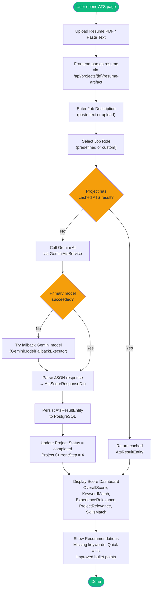
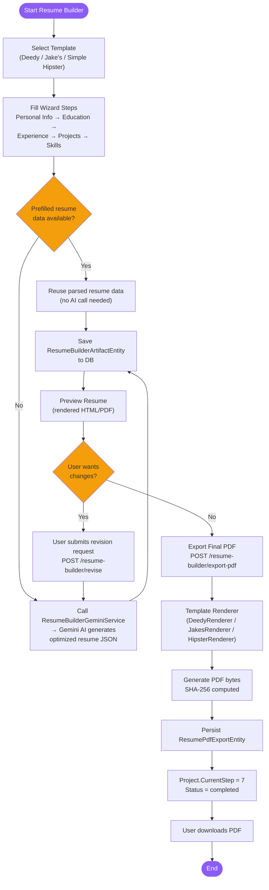
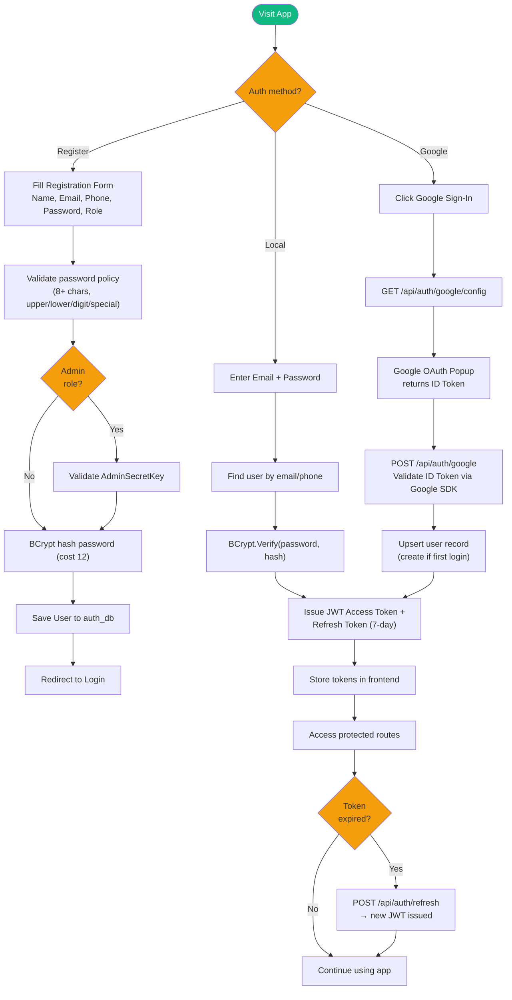

## 5. Workflow / Activity Diagram

### 5a. ATS Resume Scoring Workflow

```mermaid
flowchart TD
    Start([User opens ATS page]) --> Upload["Upload Resume PDF / Paste Text"]
    Upload --> ParseResume["Frontend parses resume<br/>via /api/projects/{id}/resume-artifact"]
    ParseResume --> EnterJD["Enter Job Description<br/>(paste text or upload)"]
    EnterJD --> SelectRole["Select Job Role<br/>(predefined or custom)"]
    SelectRole --> HasCache{Project has<br/>cached ATS result?}
    HasCache -->|Yes| ReturnCached["Return cached<br/>AtsResultEntity"]
    HasCache -->|No| CallGemini["Call Gemini AI<br/>via GeminiAtsService"]
    CallGemini --> Fallback{Primary model<br/>succeeded?}
    Fallback -->|No| TryFallback["Try fallback Gemini model<br/>(GeminiModelFallbackExecutor)"]
    TryFallback --> ParseResult
    Fallback -->|Yes| ParseResult["Parse JSON response<br/>→ AtsScoreResponseDto"]
    ParseResult --> PersistResult["Persist AtsResultEntity<br/>to PostgreSQL"]
    PersistResult --> UpdateProject["Update Project.Status = completed<br/>Project.CurrentStep = 4"]
    UpdateProject --> DisplayScore["Display Score Dashboard<br/>OverallScore, KeywordMatch,<br/>ExperienceRelevance,<br/>ProjectRelevance, SkillsMatch"]
    DisplayScore --> ShowRecommendations["Show Recommendations<br/>Missing keywords, Quick wins,<br/>Improved bullet points"]
    ReturnCached --> DisplayScore
    ShowRecommendations --> End([Done])

    style Start fill:#10b981,color:#fff
    style End fill:#10b981,color:#fff
    style HasCache fill:#f59e0b
    style Fallback fill:#f59e0b
```

### 5b. Resume Builder Workflow

```mermaid
flowchart TD
    S([Start Resume Builder]) --> SelectTemplate["Select Template<br/>(Deedy / Jake's / Simple Hipster)"]
    SelectTemplate --> FillWizard["Fill Wizard Steps<br/>Personal Info → Education →<br/>Experience → Projects → Skills"]
    FillWizard --> HasPrefilled{Prefilled resume<br/>data available?}
    HasPrefilled -->|Yes| ReuseData["Reuse parsed resume data<br/>(no AI call needed)"]
    HasPrefilled -->|No| CallGeminiRB["Call ResumeBuilderGeminiService<br/>→ Gemini AI generates<br/>optimized resume JSON"]
    ReuseData --> SaveArtifact
    CallGeminiRB --> SaveArtifact["Save ResumeBuilderArtifactEntity<br/>to DB"]
    SaveArtifact --> PreviewResume["Preview Resume<br/>(rendered HTML/PDF)"]
    PreviewResume --> WantsRevision{User wants<br/>changes?}
    WantsRevision -->|Yes| RevisionRequest["User submits revision request<br/>POST /resume-builder/revise"]
    RevisionRequest --> CallGeminiRB
    WantsRevision -->|No| ExportPdf["Export Final PDF<br/>POST /resume-builder/export-pdf"]
    ExportPdf --> RenderTemplate["Template Renderer<br/>(DeedyRenderer / JakesRenderer / HipsterRenderer)"]
    RenderTemplate --> GeneratePdf["Generate PDF bytes<br/>SHA-256 computed"]
    GeneratePdf --> PersistPdfExport["Persist ResumePdfExportEntity"]
    PersistPdfExport --> UpdateStep["Project.CurrentStep = 7<br/>Status = completed"]
    UpdateStep --> DownloadPdf["User downloads PDF"]
    DownloadPdf --> E([End])

    style S fill:#8b5cf6,color:#fff
    style E fill:#8b5cf6,color:#fff
    style HasPrefilled fill:#f59e0b
    style WantsRevision fill:#f59e0b
```

### 5c. User Authentication Workflow

```mermaid
flowchart TD
    A([Visit App]) --> AuthMethod{Auth method?}
    AuthMethod -->|Local| LoginForm["Enter Email + Password"]
    AuthMethod -->|Google| GoogleBtn["Click Google Sign-In"]
    AuthMethod -->|Register| RegForm["Fill Registration Form<br/>Name, Email, Phone, Password, Role"]

    RegForm --> ValidatePolicy["Validate password policy<br/>(8+ chars, upper/lower/digit/special)"]
    ValidatePolicy --> AdminRole{Admin<br/>role?}
    AdminRole -->|Yes| ValidateAdminKey["Validate AdminSecretKey"]
    AdminRole -->|No| HashPwd
    ValidateAdminKey --> HashPwd["BCrypt hash password (cost 12)"]
    HashPwd --> SaveUser["Save User to auth_db"]
    SaveUser --> RedirectLogin["Redirect to Login"]

    LoginForm --> FindUser["Find user by email/phone"]
    FindUser --> VerifyHash["BCrypt.Verify(password, hash)"]
    VerifyHash --> IssueTokens

    GoogleBtn --> GetGoogleClientId["GET /api/auth/google/config"]
    GetGoogleClientId --> GooglePopup["Google OAuth Popup<br/>returns ID Token"]
    GooglePopup --> ValidateIdToken["POST /api/auth/google<br/>Validate ID Token via Google SDK"]
    ValidateIdToken --> UpsertUser["Upsert user record<br/>(create if first login)"]
    UpsertUser --> IssueTokens

    IssueTokens["Issue JWT Access Token +<br/>Refresh Token (7-day)"] --> StoreTokens["Store tokens in frontend"]
    StoreTokens --> AccessApp["Access protected routes"]

    AccessApp --> TokenExpired{Token<br/>expired?}
    TokenExpired -->|Yes| RefreshFlow["POST /api/auth/refresh<br/>→ new JWT issued"]
    TokenExpired -->|No| Continue["Continue using app"]
    RefreshFlow --> Continue

    style A fill:#10b981,color:#fff
    style AuthMethod fill:#f59e0b
    style AdminRole fill:#f59e0b
    style TokenExpired fill:#f59e0b
```

---

