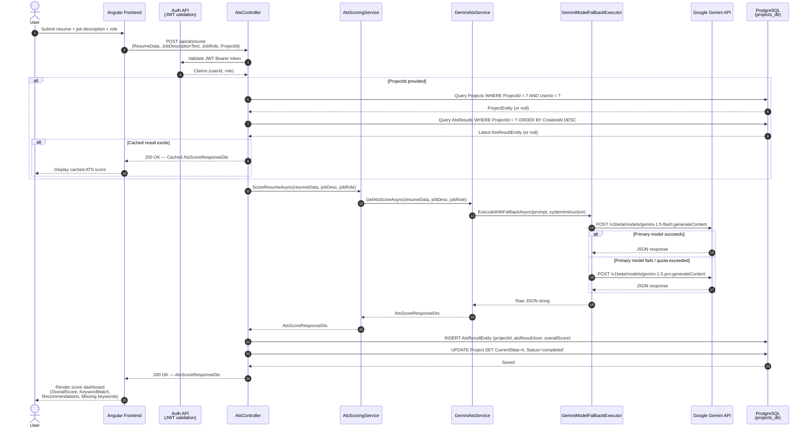

## 6. UML Sequence Diagram — ATS Scoring Flow

```mermaid
sequenceDiagram
    autonumber
    actor User
    participant FE as Angular Frontend
    participant AuthAPI as Auth API<br/>(JWT validation)
    participant AtsCtrl as AtsController
    participant AtsSvc as AtsScoringService
    participant GeminiSvc as GeminiAtsService
    participant Fallback as GeminiModelFallbackExecutor
    participant Gemini as Google Gemini API
    participant DB as PostgreSQL<br/>(projects_db)

    User->>FE: Submit resume + job description + role
    FE->>AtsCtrl: POST /api/ats/score<br/>{ResumeData, JobDescriptionText, JobRole, ProjectId}
    AtsCtrl->>AuthAPI: Validate JWT Bearer token
    AuthAPI-->>AtsCtrl: Claims (userId, role)

    alt ProjectId provided
        AtsCtrl->>DB: Query Projects WHERE ProjectId = ? AND UserId = ?
        DB-->>AtsCtrl: ProjectEntity (or null)
        AtsCtrl->>DB: Query AtsResults WHERE ProjectId = ? ORDER BY CreatedAt DESC
        DB-->>AtsCtrl: Latest AtsResultEntity (or null)

        alt Cached result exists
            AtsCtrl-->>FE: 200 OK — Cached AtsScoreResponseDto
            FE-->>User: Display cached ATS score
        end
    end

    AtsCtrl->>AtsSvc: ScoreResumeAsync(resumeData, jobDesc, jobRole)
    AtsSvc->>GeminiSvc: GetAtsScoreAsync(resumeData, jobDesc, jobRole)
    GeminiSvc->>Fallback: ExecuteWithFallbackAsync(prompt, systemInstruction)
    Fallback->>Gemini: POST /v1beta/models/gemini-1.5-flash:generateContent
    
    alt Primary model succeeds
        Gemini-->>Fallback: JSON response
    else Primary model fails / quota exceeded
        Fallback->>Gemini: POST /v1beta/models/gemini-1.5-pro:generateContent
        Gemini-->>Fallback: JSON response
    end

    Fallback-->>GeminiSvc: Raw JSON string
    GeminiSvc-->>AtsSvc: AtsScoreResponseDto
    AtsSvc-->>AtsCtrl: AtsScoreResponseDto

    AtsCtrl->>DB: INSERT AtsResultEntity (projectId, atsResultJson, overallScore)
    AtsCtrl->>DB: UPDATE Project SET CurrentStep=4, Status='completed'
    DB-->>AtsCtrl: Saved

    AtsCtrl-->>FE: 200 OK — AtsScoreResponseDto
    FE-->>User: Render score dashboard<br/>(OverallScore, KeywordMatch,<br/>Recommendations, Missing keywords)
```

---

