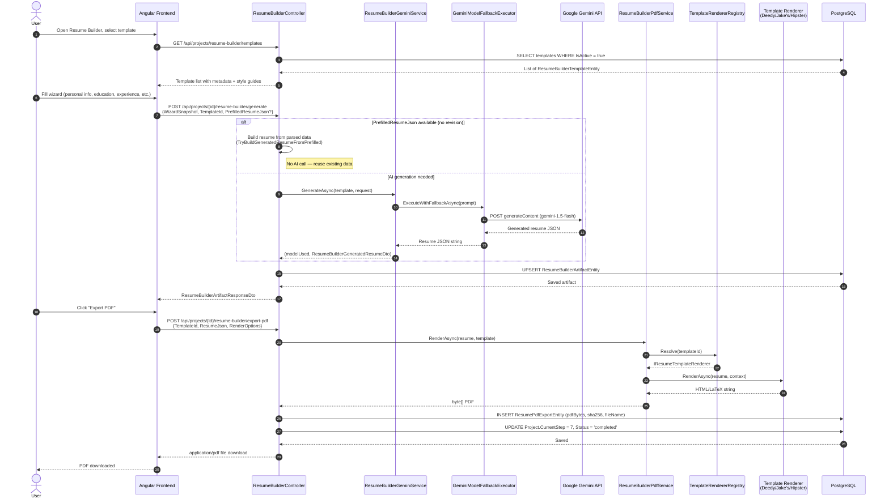

## 7. UML Sequence Diagram — Resume Builder Flow

```mermaid
sequenceDiagram
    autonumber
    actor User
    participant FE as Angular Frontend
    participant RBCtrl as ResumeBuilderController
    participant RBGemini as ResumeBuilderGeminiService
    participant Fallback as GeminiModelFallbackExecutor
    participant Gemini as Google Gemini API
    participant PdfSvc as ResumeBuilderPdfService
    participant Registry as TemplateRendererRegistry
    participant Renderer as Template Renderer<br/>(Deedy/Jake's/Hipster)
    participant DB as PostgreSQL

    User->>FE: Open Resume Builder, select template
    FE->>RBCtrl: GET /api/projects/resume-builder/templates
    RBCtrl->>DB: SELECT templates WHERE IsActive = true
    DB-->>RBCtrl: List of ResumeBuilderTemplateEntity
    RBCtrl-->>FE: Template list with metadata + style guides

    User->>FE: Fill wizard (personal info, education, experience, etc.)
    FE->>RBCtrl: POST /api/projects/{id}/resume-builder/generate<br/>{WizardSnapshot, TemplateId, PrefilledResumeJson?}
    
    alt PrefilledResumeJson available (no revision)
        RBCtrl->>RBCtrl: Build resume from parsed data<br/>(TryBuildGeneratedResumeFromPrefilled)
        Note right of RBCtrl: No AI call — reuse existing data
    else AI generation needed
        RBCtrl->>RBGemini: GenerateAsync(template, request)
        RBGemini->>Fallback: ExecuteWithFallbackAsync(prompt)
        Fallback->>Gemini: POST generateContent (gemini-1.5-flash)
        Gemini-->>Fallback: Generated resume JSON
        Fallback-->>RBGemini: Resume JSON string
        RBGemini-->>RBCtrl: (modelUsed, ResumeBuilderGeneratedResumeDto)
    end

    RBCtrl->>DB: UPSERT ResumeBuilderArtifactEntity
    DB-->>RBCtrl: Saved artifact
    RBCtrl-->>FE: ResumeBuilderArtifactResponseDto

    User->>FE: Click "Export PDF"
    FE->>RBCtrl: POST /api/projects/{id}/resume-builder/export-pdf<br/>{TemplateId, ResumeJson, RenderOptions}
    RBCtrl->>PdfSvc: RenderAsync(resume, template)
    PdfSvc->>Registry: Resolve(templateId)
    Registry-->>PdfSvc: IResumeTemplateRenderer
    PdfSvc->>Renderer: RenderAsync(resume, context)
    Renderer-->>PdfSvc: HTML/LaTeX string
    PdfSvc-->>RBCtrl: byte[] PDF

    RBCtrl->>DB: INSERT ResumePdfExportEntity (pdfBytes, sha256, fileName)
    RBCtrl->>DB: UPDATE Project.CurrentStep = 7, Status = 'completed'
    DB-->>RBCtrl: Saved
    RBCtrl-->>FE: application/pdf file download
    FE-->>User: PDF downloaded
```

---

