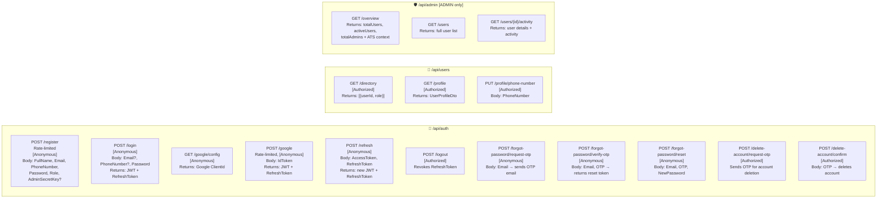

## 8. API / Endpoints Map — Auth API

> Base URL: `https://<host>/api`  
> All endpoints require **JWT Bearer** unless marked `[Anonymous]`

```mermaid
graph LR
    subgraph AUTH["🔐 /api/auth"]
        A1["POST /register<br/>Rate-limited<br/>[Anonymous]<br/>Body: FullName, Email, PhoneNumber,<br/>Password, Role, AdminSecretKey?"]
        A2["POST /login<br/>[Anonymous]<br/>Body: Email?, PhoneNumber?, Password<br/>Returns: JWT + RefreshToken"]
        A3["GET /google/config<br/>[Anonymous]<br/>Returns: Google ClientId"]
        A4["POST /google<br/>Rate-limited, [Anonymous]<br/>Body: IdToken<br/>Returns: JWT + RefreshToken"]
        A5["POST /refresh<br/>[Anonymous]<br/>Body: AccessToken, RefreshToken<br/>Returns: new JWT + RefreshToken"]
        A6["POST /logout<br/>[Authorized]<br/>Revokes RefreshToken"]
        A7["POST /forgot-password/request-otp<br/>[Anonymous]<br/>Body: Email → sends OTP email"]
        A8["POST /forgot-password/verify-otp<br/>[Anonymous]<br/>Body: Email, OTP → returns reset token"]
        A9["POST /forgot-password/reset<br/>[Anonymous]<br/>Body: Email, OTP, NewPassword"]
        A10["POST /delete-account/request-otp<br/>[Authorized]<br/>Sends OTP for account deletion"]
        A11["POST /delete-account/confirm<br/>[Authorized]<br/>Body: OTP → deletes account"]
    end

    subgraph USERS["👤 /api/users"]
        U1["GET /directory<br/>[Authorized]<br/>Returns: [{userId, role}]"]
        U2["GET /profile<br/>[Authorized]<br/>Returns: UserProfileDto"]
        U3["PUT /profile/phone-number<br/>[Authorized]<br/>Body: PhoneNumber"]
    end

    subgraph ADMIN_AUTH["🛡️ /api/admin [ADMIN only]"]
        AA1["GET /overview<br/>Returns: totalUsers, activeUsers,<br/>totalAdmins + ATS context"]
        AA2["GET /users<br/>Returns: full user list"]
        AA3["GET /users/{id}/activity<br/>Returns: user details + activity"]
    end
```

---

