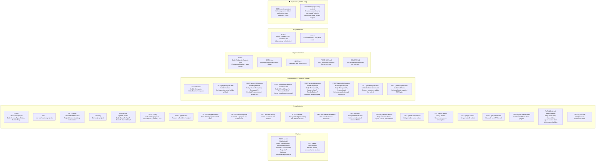

## 9. API / Endpoints Map — ATSScore API

> Base URL: `https://<host>/api`  
> All endpoints require **JWT Bearer** unless marked `[Anonymous]`

```mermaid
graph LR
    subgraph ATS["🤖 /api/ats"]
        AT1["POST /score<br/>[Authorized]<br/>Body: ResumeData, JobDescriptionText,<br/>JobRole, CustomRole?, ProjectId?<br/>Returns: AtsScoreResponseDto"]
        AT2["GET /health<br/>[Anonymous]<br/>Returns: status, serviceName, utcNow"]
    end

    subgraph PROJ["📁 /api/projects"]
        P1["POST /<br/>Create new project<br/>Body: Name, Type, Status, CurrentStep"]
        P2["GET /<br/>List user's active projects"]
        P3["GET /history<br/>?includeDeleted=true<br/>Project history including soft-deleted"]
        P4["GET /{id}<br/>Get single project"]
        P5["PATCH /{id}<br/>Update project<br/>Body: Name?, Type?, Status?, CurrentStep?"]
        P6["DELETE /{id}<br/>Soft-delete project + cascade JD + wizard + ATS"]
        P7["POST /{id}/restore<br/>Restore soft-deleted project"]
        P8["DELETE /{id}/permanent<br/>Hard-delete project and all data"]
        P9["DELETE /account/purge<br/>Delete ALL projects for current user"]

        P10["GET /resume-library<br/>User's saved resume artifacts"]
        P11["POST /resume-library/default/{resumeId}<br/>Set default resume"]
        P12["GET /resume-library/default<br/>Get default resume metadata"]
        P13["GET /resume-library/default/resolve<br/>Get resolved default resume JSON"]

        P14["PUT /{id}/resume-artifact<br/>Body: resume file/text<br/>Upsert parsed resume data"]
        P15["GET /{id}/resume-artifact<br/>Get parsed resume artifact"]
        P16["PUT /{id}/jd-artifact<br/>Body: JD text<br/>Upsert parsed job description"]
        P17["GET /{id}/jd-artifact<br/>Get parsed JD artifact"]

        P18["POST /{id}/ats-results<br/>Manually post ATS result"]
        P19["GET /{id}/ats-results/latest<br/>Get latest ATS result for project"]

        P20["PUT /{id}/wizard-state/{module}<br/>Body: StateJson, CurrentStep<br/>Upsert wizard state (ats/resume-builder)"]
        P21["GET /{id}/wizard-state/{module}<br/>Get wizard state"]
    end

    subgraph RB["🏗️ /api/projects — Resume Builder"]
        RB1["GET /resume-builder/templates<br/>List all active templates"]
        RB2["GET /{projectId}/resume-builder/artifact<br/>Get current resume builder artifact"]
        RB3["POST /{projectId}/resume-builder/generate<br/>Body: WizardSnapshot, TemplateId?,<br/>PrefilledResumeJson?, TargetRole?"]
        RB4["POST /{projectId}/resume-builder/revise<br/>Body: WizardSnapshot + RevisionContext<br/>(same handler as generate)"]
        RB5["POST /{projectId}/resume-builder/export-pdf<br/>Body: TemplateId?, ResumeJson?, RenderOptions?<br/>Returns: application/pdf"]
        RB6["POST /{projectId}/resume-builder/preview-pdf<br/>Body: TemplateId?, ResumeJson?<br/>Returns: application/pdf (unsaved)"]
        RB7["GET /{projectId}/resume-builder/pdf/latest/metadata<br/>Returns: export metadata (no bytes)"]
        RB8["GET /{projectId}/resume-builder/pdf/latest<br/>Returns: latest exported PDF bytes"]
    end

    subgraph NOTIF["🔔 /api/notifications"]
        N1["POST /<br/>Body: ToUserId, Subject, Body<br/>Creates notification + user states"]
        N2["GET /inbox<br/>Recipient's inbox with read status"]
        N3["GET /sent<br/>Sender's sent notifications"]
        N4["POST /{id}/read<br/>Mark notification as read for current user"]
        N5["DELETE /{id}<br/>Soft-delete notification for current user"]
    end

    subgraph FEED["⭐ /api/feedback"]
        F1["POST /<br/>Body: Rating (1–10), FeedbackText<br/>(Users only, not admins)"]
        F2["GET /<br/>List all feedback (any auth user)"]
    end

    subgraph ADMIN_ATS["🛡️ /api/admin [ADMIN only]"]
        AD1["GET /overview-context<br/>Returns: project stats + notification stats + feedback count"]
        AD2["GET /users/{id}/activity-context<br/>Returns: projectCount, completedProjects,<br/>notification stats, recent projects"]
    end
```

---

