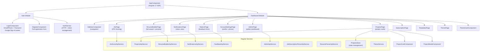

## 10. Frontend Component Tree

```mermaid
graph TD
    App["AppComponent<br/>(Angular 17 SSR)"]

    App --> AuthModule["Auth Module"]
    App --> DashboardModule["Dashboard Module"]

    AuthModule --> LoginComp["LoginComponent<br/>Email/Phone + Password<br/>Google Sign-In button"]
    AuthModule --> RegisterComp["RegisterComponent<br/>Full registration form"]
    AuthModule --> AuthSvc["AuthService<br/>(HTTP + token management)"]

    DashboardModule --> Sidebar["SidebarComponent<br/>(navigation)"]
    DashboardModule --> AtsPage["AtsPage<br/>(ATS Scoring)"]
    DashboardModule --> ResumePage["ResumeBuilderPage<br/>(full wizard + preview)"]
    DashboardModule --> ProjectsPage["ProjectsPage<br/>(project cards)"]
    DashboardModule --> NotifPage["NotificationsPage<br/>(inbox view)"]
    DashboardModule --> AccountPage["AccountSettingsPage<br/>(profile + phone)"]
    DashboardModule --> AdminPage["AdminPage<br/>(admin dashboard)"]
    DashboardModule --> RateUsPage["RateUsPage<br/>(feedback form)"]
    DashboardModule --> SubscriptionPage["SubscriptionPage"]
    DashboardModule --> TemplatesPage["TemplatesPage"]
    DashboardModule --> ThemePage["ThemePage"]

    ProjectsPage --> ProjectCardComp["ProjectCardComponent"]
    ProjectsPage --> ProjectModalComp["ProjectModalComponent"]
    DashboardModule --> ThemeCardComp["ThemeCardComponent"]

    subgraph Services["Angular Services"]
        AtsScoreApiSvc["AtsScoreApiService"]
        ProjectsApiSvc["ProjectsApiService"]
        ResumeBuilderApiSvc["ResumeBuilderApiService"]
        NotificationsApiSvc["NotificationsApiService"]
        FeedbackApiSvc["FeedbackApiService"]
        AdminApiSvc["AdminApiService"]
        JobDescParserSvc["JobDescriptionParserApiService"]
        ResumeParserSvc["ResumeParserApiService"]
        ProjectsStore["ProjectsStore<br/>(state management)"]
        ThemeSvc["ThemeService"]
    end

    AtsPage --> AtsScoreApiSvc
    ResumePage --> ResumeBuilderApiSvc
    ProjectsPage --> ProjectsApiSvc
    ProjectsPage --> ProjectsStore
    NotifPage --> NotificationsApiSvc
    RateUsPage --> FeedbackApiSvc
    AdminPage --> AdminApiSvc
```

---

