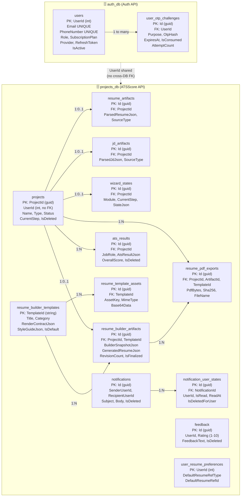

## 11. Database Schema Overview

```mermaid
graph TB
    subgraph AuthDB["🗄️ auth_db (Auth API)"]
        Users["users<br/>PK: UserId (int)<br/>Email UNIQUE<br/>PhoneNumber UNIQUE<br/>Role, SubscriptionPlan<br/>Provider, RefreshToken<br/>IsActive"]
        OTP["user_otp_challenges<br/>PK: Id (guid)<br/>FK: UserId<br/>Purpose, OtpHash<br/>ExpiresAt, IsConsumed<br/>AttemptCount"]
        Users -->|1 to many| OTP
    end

    subgraph ProjectsDB["🗄️ projects_db (ATSScore API)"]
        Projects["projects<br/>PK: ProjectId (guid)<br/>UserId (int, no FK)<br/>Name, Type, Status<br/>CurrentStep, IsDeleted"]
        
        ResumeArtifacts["resume_artifacts<br/>PK: Id (guid)<br/>FK: ProjectId<br/>ParsedResumeJson, SourceType"]
        
        JdArtifacts["jd_artifacts<br/>PK: Id (guid)<br/>FK: ProjectId<br/>ParsedJdJson, SourceType"]
        
        WizardStates["wizard_states<br/>PK: Id (guid)<br/>FK: ProjectId<br/>Module, CurrentStep, StateJson"]
        
        AtsResults["ats_results<br/>PK: Id (guid)<br/>FK: ProjectId<br/>JobRole, AtsResultJson<br/>OverallScore, IsDeleted"]
        
        RBTemplates["resume_builder_templates<br/>PK: TemplateId (string)<br/>Title, Category<br/>RenderContractJson<br/>StyleGuideJson, IsDefault"]
        
        RBAssets["resume_template_assets<br/>PK: Id (guid)<br/>FK: TemplateId<br/>AssetKey, MimeType<br/>Base64Data"]
        
        RBArtifacts["resume_builder_artifacts<br/>PK: Id (guid)<br/>FK: ProjectId, TemplateId<br/>BuilderSnapshotJson<br/>GeneratedResumeJson<br/>RevisionCount, IsFinalized"]
        
        PdfExports["resume_pdf_exports<br/>PK: Id (guid)<br/>FK: ProjectId, ArtifactId, TemplateId<br/>PdfBytes, Sha256, FileName"]
        
        Notifications["notifications<br/>PK: Id (guid)<br/>SenderUserId, RecipientUserId<br/>Subject, Body, IsDeleted"]
        
        NotifStates["notification_user_states<br/>PK: Id (guid)<br/>FK: NotificationId<br/>UserId, IsRead, ReadAt<br/>IsDeletedForUser"]
        
        Feedback["feedback<br/>PK: Id (guid)<br/>UserId, Rating (1-10)<br/>FeedbackText, IsDeleted"]
        
        UserPrefs["user_resume_preferences<br/>PK: UserId (int)<br/>DefaultResumeRefType<br/>DefaultResumeRefId"]

        Projects -->|1:0..1| ResumeArtifacts
        Projects -->|1:0..1| JdArtifacts
        Projects -->|1:0..1| WizardStates
        Projects -->|1:0..1| RBArtifacts
        Projects -->|1:N| AtsResults
        Projects -->|1:N| PdfExports
        RBTemplates -->|1:N| RBArtifacts
        RBTemplates -->|1:N| RBAssets
        RBArtifacts -->|1:N| PdfExports
        Notifications -->|1:N| NotifStates
    end

    AuthDB -.->|"UserId shared<br/>(no cross-DB FK)"| ProjectsDB
```

---

