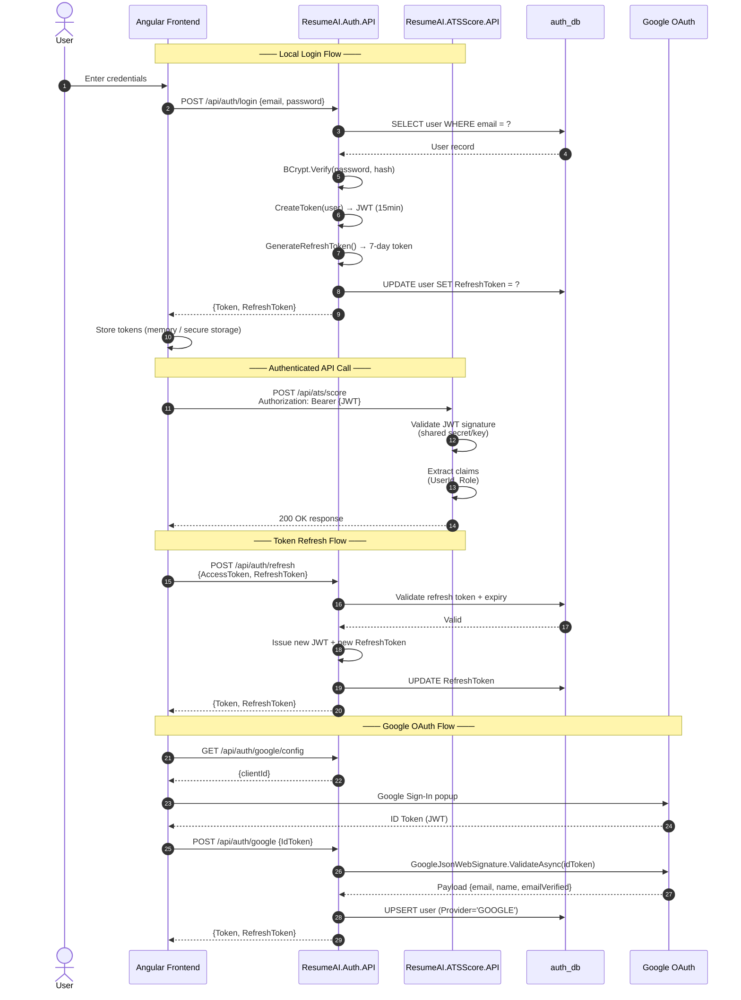

## 12. Authentication & Token Flow

---

## Summary — Technology Stack

| Layer | Technology |
|---|---|
| **Frontend** | Angular 17 (SSR via Angular Universal / Node.js) |
| **Auth API** | ASP.NET Core 8, Entity Framework Core, BCrypt.Net, Google.Apis.Auth |
| **Core API** | ASP.NET Core 8, Entity Framework Core, Npgsql |
| **AI Engine** | Google Gemini API (gemini-1.5-flash with pro fallback) |
| **Database** | PostgreSQL (two separate databases: auth_db, projects_db) |
| **PDF Generation** | Custom HTML/LaTeX template renderers (Deedy, Jake's, Hipster) |
| **Auth** | JWT Bearer tokens + Refresh Tokens + Google OAuth 2.0 + OTP (email) |
| **Containerization** | Docker (Dockerfile per service) |
| **Soft Deletes** | All major entities use `IsDeleted` flag pattern |
| **Data Safety** | `ProjectDatabaseSanitizer` (Win1252 encoding for PostgreSQL compatibility) |
