# AI Resume Builder — Architecture & Design Diagrams

> **Render tip:** Open this file in VS Code and install the **"Markdown Preview Mermaid Support"** extension (by Matt Bierner) to see all diagrams rendered inline. Alternatively use [mermaid.live](https://mermaid.live) to paste individual blocks.

---

## Table of Contents

1. [System Architecture Diagram](#1-system-architecture-diagram)
2. [Services / Microservices Diagram](#2-services--microservices-diagram)
3. [Entity-Relationship Diagram (ERD)](#3-entity-relationship-diagram-erd)
4. [UML Class Diagram](#4-uml-class-diagram)
5. [Workflow / Activity Diagram](#5-workflow--activity-diagram)
6. [UML Sequence Diagram — ATS Scoring Flow](#6-uml-sequence-diagram--ats-scoring-flow)
7. [UML Sequence Diagram — Resume Builder Flow](#7-uml-sequence-diagram--resume-builder-flow)
8. [API / Endpoints Map — Auth API](#8-api--endpoints-map--auth-api)
9. [API / Endpoints Map — ATSScore API](#9-api--endpoints-map--atsscore-api)
10. [Frontend Component Tree](#10-frontend-component-tree)
11. [Database Schema Overview](#11-database-schema-overview)
12. [Authentication & Token Flow](#12-authentication--token-flow)

---

## 1. System Architecture Diagram

```mermaid
graph TB
    subgraph Client["🖥️ Client Layer"]
        FE["Angular 17 SSR Frontend<br/>ResumeBuilderFrontend<br/>(Angular Universal / Node.js)"]
    end

    subgraph Gateway["🔀 API Gateway / Reverse Proxy"]
        NG["Nginx / Load Balancer<br/>(Dockerized)"]
    end

    subgraph AuthService["🔐 Auth Microservice<br/>ResumeAI.Auth.API (.NET 8)"]
        AC["AuthController"]
        UC["UsersController"]
        AuthAdminC["AdminController"]
        TS["TokenService (JWT)"]
        ES["EmailService (OTP)"]
        OS["OtpService"]
        AuthDB[("PostgreSQL<br/>auth_db<br/>Users + OTP Challenges")]
    end

    subgraph ATSService["🤖 Core AI Microservice<br/>ResumeAI.ATSScore.API (.NET 8)"]
        AtsC["AtsController"]
        ProjC["ProjectsController"]
        RBC["ResumeBuilderController"]
        NotifC["NotificationsController"]
        FeedC["FeedbackController"]
        AtsAdminC["AdminController"]
        
        AtsScoreSvc["AtsScoringService"]
        GeminiAtsSvc["GeminiAtsService"]
        GeminiFallback["GeminiModelFallbackExecutor"]
        RBGeminiSvc["ResumeBuilderGeminiService"]
        RBPdfSvc["ResumeBuilderPdfService"]
        
        subgraph TemplateRenderers["Template Rendering Engine"]
            TRR["ResumeTemplateRendererRegistry"]
            DeedyR["DeedyResumeRenderer"]
            JakesR["JakesResumeRenderer"]
            HipsterR["SimpleHipsterResumeRenderer"]
        end
        
        AtsDB[("PostgreSQL<br/>projects_db<br/>All project data")]
    end

    subgraph External["☁️ External Services"]
        GeminiAPI["Google Gemini AI API<br/>(gemini-1.5-flash / pro)"]
        GoogleOAuth["Google OAuth 2.0<br/>(ID Token Validation)"]
        EmailProvider["Email Provider<br/>(SMTP / SendGrid)"]
    end

    FE -->|"HTTPS requests"| NG
    NG -->|"/api/auth/*"| AuthService
    NG -->|"/api/projects/* /api/ats/* /api/notifications/* /api/feedback/*"| ATSService
    AuthAdminC -->|"Internal HTTP call<br/>/api/admin/overview-context"| AtsAdminC

    AC --> TS
    AC --> ES
    AC --> OS
    AC --> GoogleOAuth
    AuthService --> AuthDB

    AtsC --> AtsScoreSvc
    AtsScoreSvc --> GeminiAtsSvc
    GeminiAtsSvc --> GeminiFallback
    RBC --> RBGeminiSvc
    RBC --> RBPdfSvc
    RBPdfSvc --> TRR
    TRR --> DeedyR
    TRR --> JakesR
    TRR --> HipsterR
    GeminiFallback --> GeminiAPI
    RBGeminiSvc --> GeminiAPI
    ES --> EmailProvider

    ATSService --> AtsDB

    style Client fill:#dbeafe,stroke:#3b82f6
    style Gateway fill:#fef3c7,stroke:#f59e0b
    style AuthService fill:#d1fae5,stroke:#10b981
    style ATSService fill:#ede9fe,stroke:#8b5cf6
    style External fill:#fee2e2,stroke:#ef4444
    style TemplateRenderers fill:#f3e8ff,stroke:#a855f7
```

---

## 2. Services / Microservices Diagram

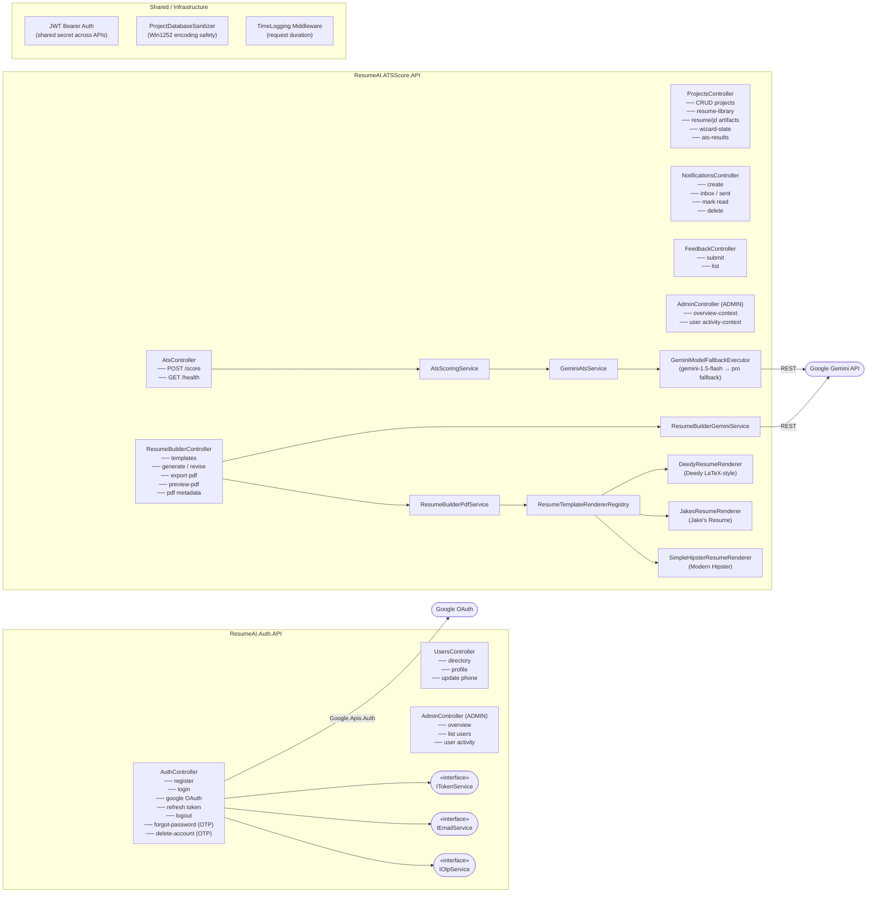

---

## 3. Entity-Relationship Diagram (ERD)

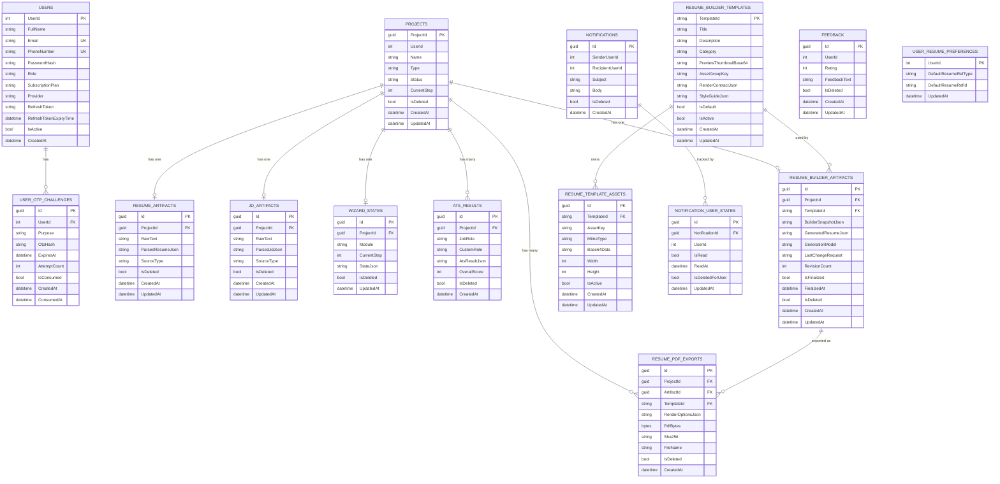

---

## 4. UML Class Diagram

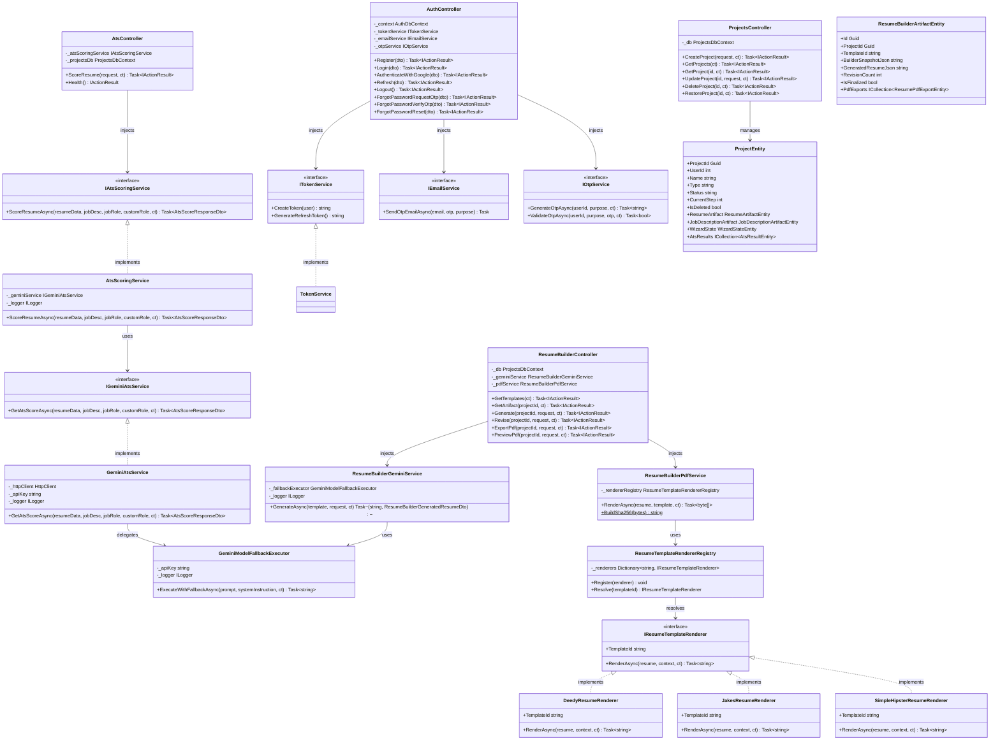

---

## 5. Workflow / Activity Diagram

### 5a. ATS Resume Scoring Workflow

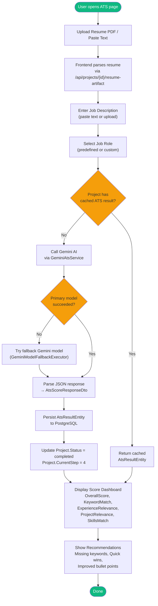

### 5b. Resume Builder Workflow

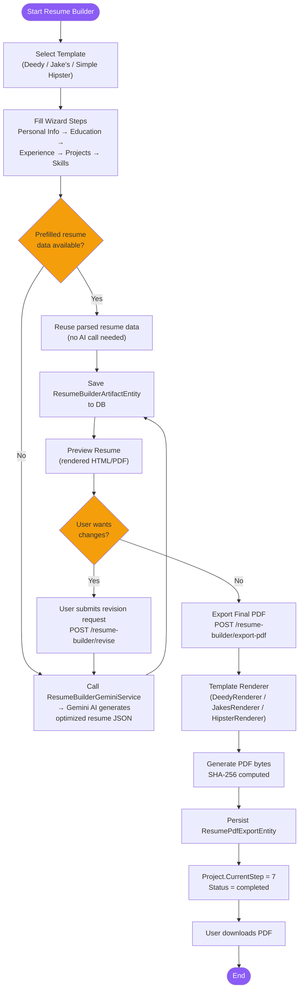

### 5c. User Authentication Workflow

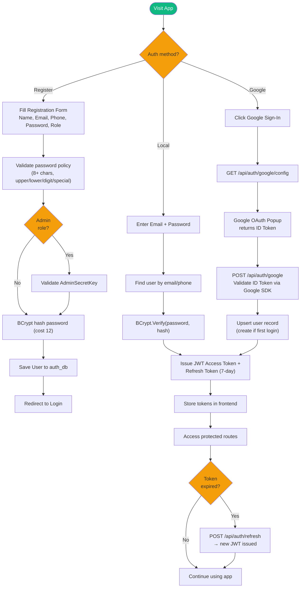

---

## 6. UML Sequence Diagram — ATS Scoring Flow

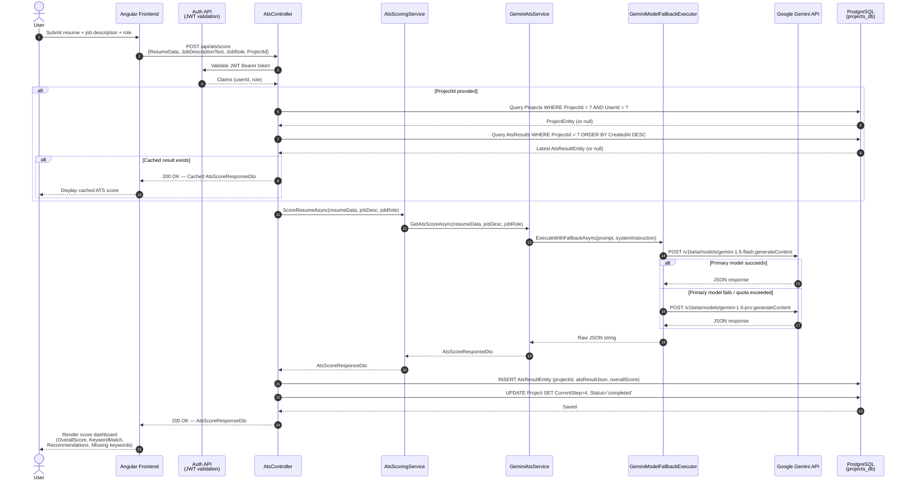

---

## 7. UML Sequence Diagram — Resume Builder Flow

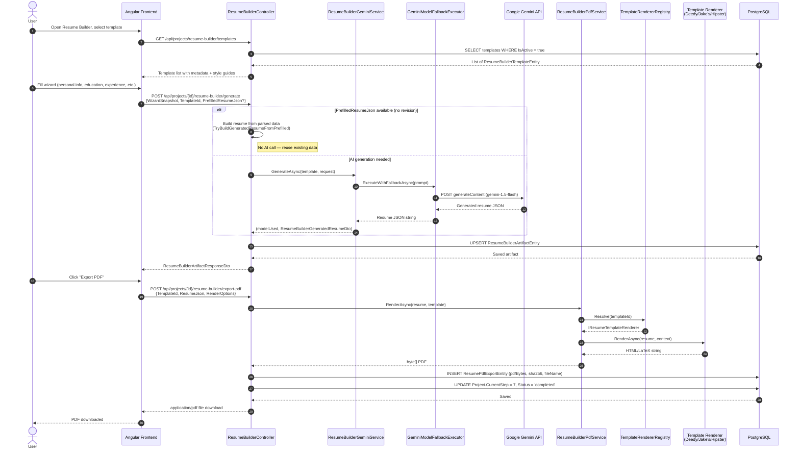

---

## 8. API / Endpoints Map — Auth API

> Base URL: `https://<host>/api`  
> All endpoints require **JWT Bearer** unless marked `[Anonymous]`

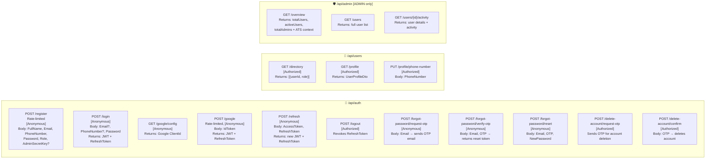

---

## 9. API / Endpoints Map — ATSScore API

> Base URL: `https://<host>/api`  
> All endpoints require **JWT Bearer** unless marked `[Anonymous]`

```mermaid
graph LR
    subgraph ATS["🤖 /api/ats"]
        AT1["POST /score<br/>[Authorized]<br/>Body: ResumeData, JobDescriptionText,<br/>JobRole, CustomRole?, ProjectId?<br/>Returns: AtsScoreResponseDto"]
        AT2["GET /health<br/>[Anonymous]<br/>Returns: status, serviceName, utcNow"]
    end

    subgraph PROJ["📁 /api/projects"]
        P1["POST /<br/>Create new project<br/>Body: Name, Type, Status, CurrentStep"]
        P2["GET /<br/>List user's active projects"]
        P3["GET /history<br/>?includeDeleted=true<br/>Project history including soft-deleted"]
        P4["GET /{id}<br/>Get single project"]
        P5["PATCH /{id}<br/>Update project<br/>Body: Name?, Type?, Status?, CurrentStep?"]
        P6["DELETE /{id}<br/>Soft-delete project + cascade JD + wizard + ATS"]
        P7["POST /{id}/restore<br/>Restore soft-deleted project"]
        P8["DELETE /{id}/permanent<br/>Hard-delete project and all data"]
        P9["DELETE /account/purge<br/>Delete ALL projects for current user"]

        P10["GET /resume-library<br/>User's saved resume artifacts"]
        P11["POST /resume-library/default/{resumeId}<br/>Set default resume"]
        P12["GET /resume-library/default<br/>Get default resume metadata"]
        P13["GET /resume-library/default/resolve<br/>Get resolved default resume JSON"]

        P14["PUT /{id}/resume-artifact<br/>Body: resume file/text<br/>Upsert parsed resume data"]
        P15["GET /{id}/resume-artifact<br/>Get parsed resume artifact"]
        P16["PUT /{id}/jd-artifact<br/>Body: JD text<br/>Upsert parsed job description"]
        P17["GET /{id}/jd-artifact<br/>Get parsed JD artifact"]

        P18["POST /{id}/ats-results<br/>Manually post ATS result"]
        P19["GET /{id}/ats-results/latest<br/>Get latest ATS result for project"]

        P20["PUT /{id}/wizard-state/{module}<br/>Body: StateJson, CurrentStep<br/>Upsert wizard state (ats/resume-builder)"]
        P21["GET /{id}/wizard-state/{module}<br/>Get wizard state"]
    end

    subgraph RB["🏗️ /api/projects — Resume Builder"]
        RB1["GET /resume-builder/templates<br/>List all active templates"]
        RB2["GET /{projectId}/resume-builder/artifact<br/>Get current resume builder artifact"]
        RB3["POST /{projectId}/resume-builder/generate<br/>Body: WizardSnapshot, TemplateId?,<br/>PrefilledResumeJson?, TargetRole?"]
        RB4["POST /{projectId}/resume-builder/revise<br/>Body: WizardSnapshot + RevisionContext<br/>(same handler as generate)"]
        RB5["POST /{projectId}/resume-builder/export-pdf<br/>Body: TemplateId?, ResumeJson?, RenderOptions?<br/>Returns: application/pdf"]
        RB6["POST /{projectId}/resume-builder/preview-pdf<br/>Body: TemplateId?, ResumeJson?<br/>Returns: application/pdf (unsaved)"]
        RB7["GET /{projectId}/resume-builder/pdf/latest/metadata<br/>Returns: export metadata (no bytes)"]
        RB8["GET /{projectId}/resume-builder/pdf/latest<br/>Returns: latest exported PDF bytes"]
    end

    subgraph NOTIF["🔔 /api/notifications"]
        N1["POST /<br/>Body: ToUserId, Subject, Body<br/>Creates notification + user states"]
        N2["GET /inbox<br/>Recipient's inbox with read status"]
        N3["GET /sent<br/>Sender's sent notifications"]
        N4["POST /{id}/read<br/>Mark notification as read for current user"]
        N5["DELETE /{id}<br/>Soft-delete notification for current user"]
    end

    subgraph FEED["⭐ /api/feedback"]
        F1["POST /<br/>Body: Rating (1–10), FeedbackText<br/>(Users only, not admins)"]
        F2["GET /<br/>List all feedback (any auth user)"]
    end

    subgraph ADMIN_ATS["🛡️ /api/admin [ADMIN only]"]
        AD1["GET /overview-context<br/>Returns: project stats + notification stats + feedback count"]
        AD2["GET /users/{id}/activity-context<br/>Returns: projectCount, completedProjects,<br/>notification stats, recent projects"]
    end
```

---

## 10. Frontend Component Tree

```mermaid
graph TD
    App["AppComponent<br/>(Angular 17 SSR)"]

    App --> AuthModule["Auth Module"]
    App --> DashboardModule["Dashboard Module"]

    AuthModule --> LoginComp["LoginComponent<br/>Email/Phone + Password<br/>Google Sign-In button"]
    AuthModule --> RegisterComp["RegisterComponent<br/>Full registration form"]
    AuthModule --> AuthSvc["AuthService<br/>(HTTP + token management)"]

    DashboardModule --> Sidebar["SidebarComponent<br/>(navigation)"]
    DashboardModule --> AtsPage["AtsPage<br/>(ATS Scoring)"]
    DashboardModule --> ResumePage["ResumeBuilderPage<br/>(full wizard + preview)"]
    DashboardModule --> ProjectsPage["ProjectsPage<br/>(project cards)"]
    DashboardModule --> NotifPage["NotificationsPage<br/>(inbox view)"]
    DashboardModule --> AccountPage["AccountSettingsPage<br/>(profile + phone)"]
    DashboardModule --> AdminPage["AdminPage<br/>(admin dashboard)"]
    DashboardModule --> RateUsPage["RateUsPage<br/>(feedback form)"]
    DashboardModule --> SubscriptionPage["SubscriptionPage"]
    DashboardModule --> TemplatesPage["TemplatesPage"]
    DashboardModule --> ThemePage["ThemePage"]

    ProjectsPage --> ProjectCardComp["ProjectCardComponent"]
    ProjectsPage --> ProjectModalComp["ProjectModalComponent"]
    DashboardModule --> ThemeCardComp["ThemeCardComponent"]

    subgraph Services["Angular Services"]
        AtsScoreApiSvc["AtsScoreApiService"]
        ProjectsApiSvc["ProjectsApiService"]
        ResumeBuilderApiSvc["ResumeBuilderApiService"]
        NotificationsApiSvc["NotificationsApiService"]
        FeedbackApiSvc["FeedbackApiService"]
        AdminApiSvc["AdminApiService"]
        JobDescParserSvc["JobDescriptionParserApiService"]
        ResumeParserSvc["ResumeParserApiService"]
        ProjectsStore["ProjectsStore<br/>(state management)"]
        ThemeSvc["ThemeService"]
    end

    AtsPage --> AtsScoreApiSvc
    ResumePage --> ResumeBuilderApiSvc
    ProjectsPage --> ProjectsApiSvc
    ProjectsPage --> ProjectsStore
    NotifPage --> NotificationsApiSvc
    RateUsPage --> FeedbackApiSvc
    AdminPage --> AdminApiSvc
```

---

## 11. Database Schema Overview

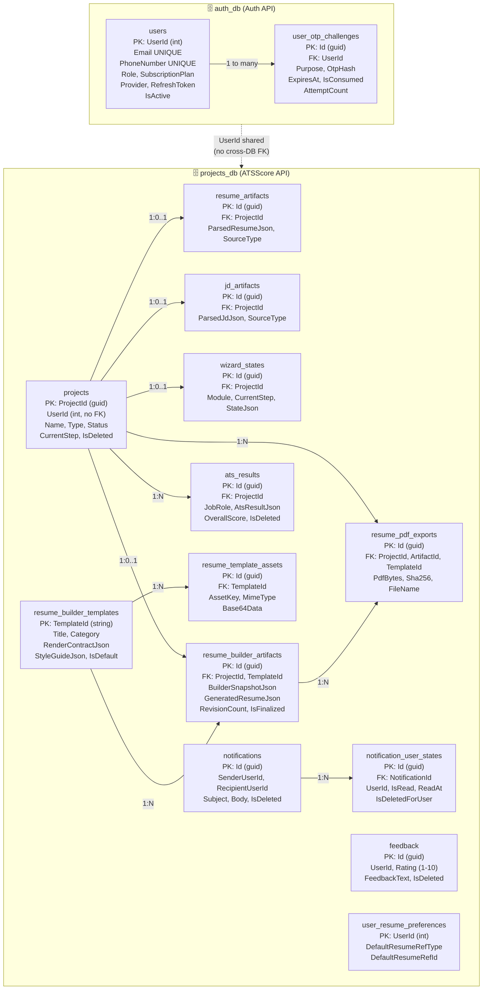

---

## 12. Authentication & Token Flow

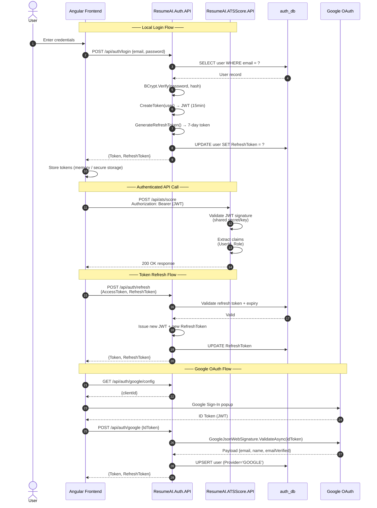

---

## Summary — Technology Stack

| Layer | Technology |
|---|---|
| **Frontend** | Angular 17 (SSR via Angular Universal / Node.js) |
| **Auth API** | ASP.NET Core 8, Entity Framework Core, BCrypt.Net, Google.Apis.Auth |
| **Core API** | ASP.NET Core 8, Entity Framework Core, Npgsql |
| **AI Engine** | Google Gemini API (gemini-1.5-flash with pro fallback) |
| **Database** | PostgreSQL (two separate databases: auth_db, projects_db) |
| **PDF Generation** | Custom HTML/LaTeX template renderers (Deedy, Jake's, Hipster) |
| **Auth** | JWT Bearer tokens + Refresh Tokens + Google OAuth 2.0 + OTP (email) |
| **Containerization** | Docker (Dockerfile per service) |
| **Soft Deletes** | All major entities use `IsDeleted` flag pattern |
| **Data Safety** | `ProjectDatabaseSanitizer` (Win1252 encoding for PostgreSQL compatibility) |
